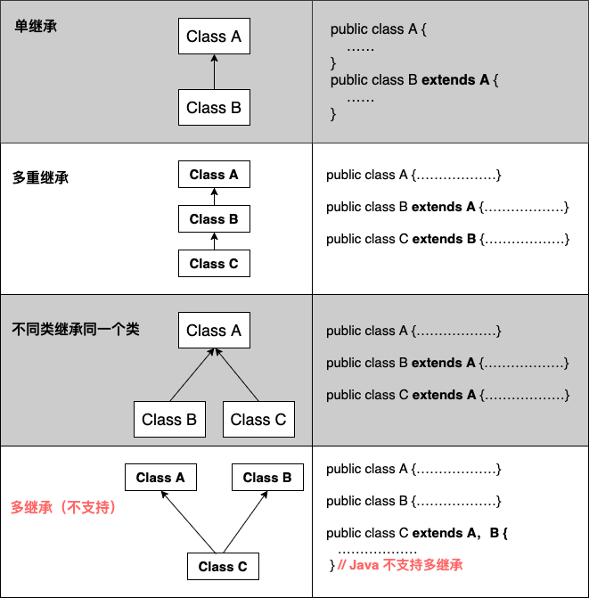

# Java继承
[Java](/back/java/README)

## 继承

在我们使用class来定义对象的时候
我们经常会发现很多对象之间又一些公共、基础的属性或行为

- 所有的UI控件（输入框、多选、单选、下拉框）都可以禁用，都有宽高
- 哺乳动物，都有身高、体重、血型等

我们在定义这些类的时候，并不想在所有的类中都定义重复的属性或者行为，那么就可以使用继承这种语法来重用代码。

我们可以把这些通用、公共的属性和行为定义在一个类中，这个类成为父类（parent） / 基类（base） / 超类（super），然后在定义子类（child/sub）来继承它。

## 继承类型

## 继承特点

子类拥有父类非private的属性、方法。

子类可以拥有自己的属性和方法，即子类可以对父类进行扩展。

子类可以用自己的方式实现父类的方法。

提高了类之间的耦合性
（继承的缺点，耦合度高就会造成代码之间的联系越紧密，代码独立性越差）。

## extends关键字

在 Java 中，类的继承是单一继承

一个子类只能拥有一个父类，所以 extends 只能继承一个类。

## super 与 this 关键字

### super关键字

我们可以通过super关键字来实现对父类成员的访问，用来引用当前对象的父类。

### this关键字

指向自己的引用

## Object

Java 中，所有的类都直接或间接的继承自Object。
因此我们定义的类自然也从这个父类获得了如下方法：

- hashCode：得到一个整数值，它是基于内存地址运算出来的
- equals：用来比较两个对象是否相等。
- toString：对象的字符串表现形式

## 方法重写

在子类中如果创建了一个与父类中相同名称、相同返回值类型、相同参数列表的方法
只是方法体中的实现不同，以实现不同于父类的功能，这种方式被称为方法重写

### 重写规则

>- 参数列表必须与被重写的方法参数列表相同
>- 返回类型必须与被重写的方法返回类型相同
>- 访问权限不能比父类中被重写方法的访问权限更低
>- 父类的成员方法只能被它的子类重写
>- 声明为 final 的方法不能被重写
>- 声明为 static 的方法不能被重写
>- 构造方法不能被重写

## 向上&向下转型

>- UpCasting：向上转换成父类类型
>- DownCasting：向下转换成子类类型

## 多态

多种形态或形式，即允许一个对象有多种体现形式。

同一个行为，在不同的条件下，有不同的效果